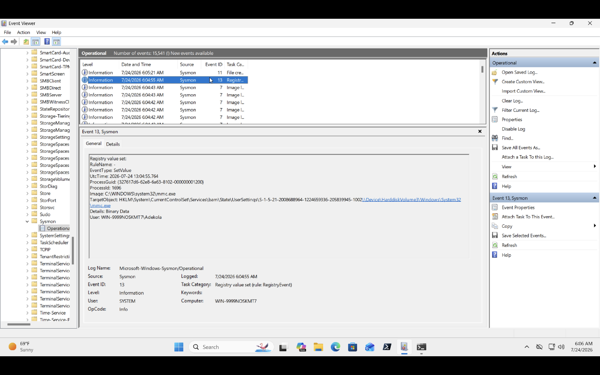
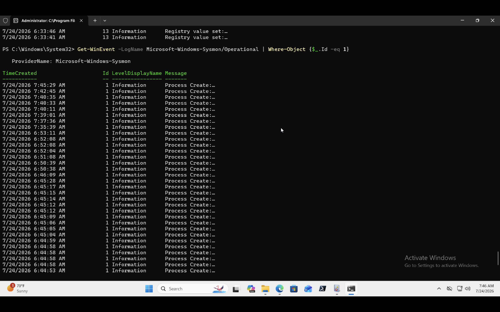
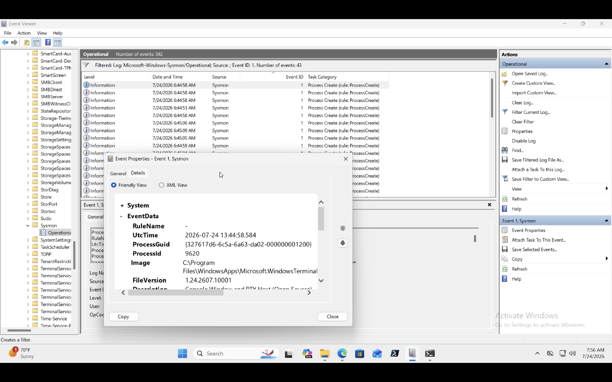
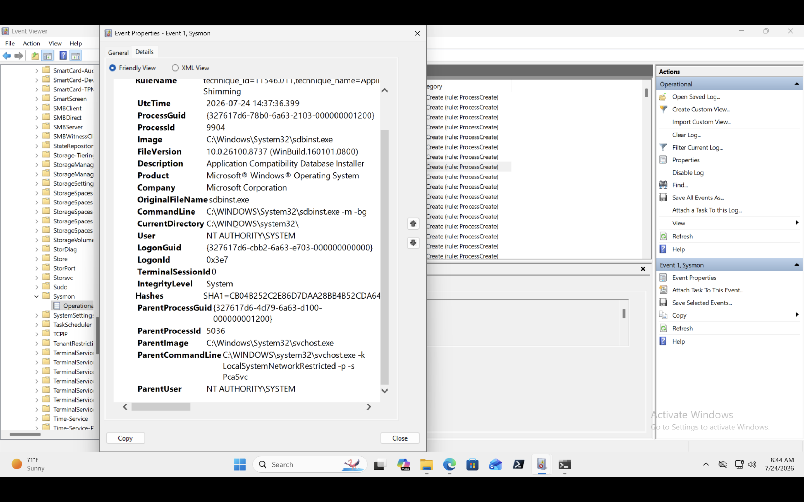
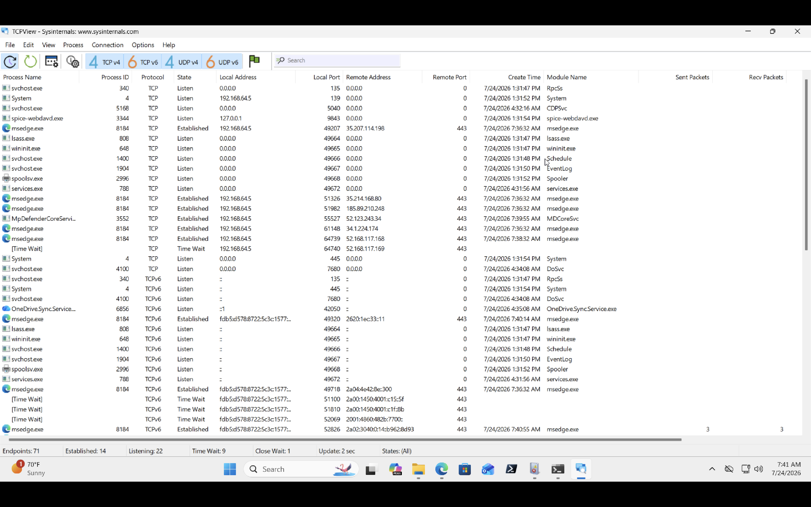
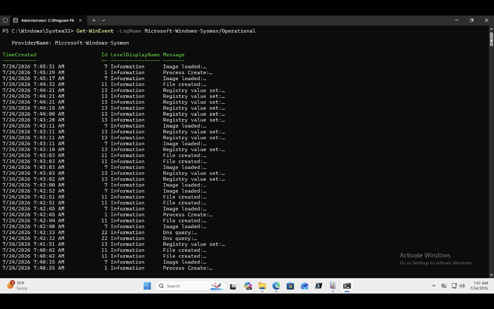

# Endpoint Monitoring Lab

## OVERVIEW

Endpoint visibility is one of the most important capabilities in modern cybersecurity. While Windows records many events by default, tools like Sysmon provide significantly richer telemetry that helps analysts understand exactly what happened on a system during an investigation.

In this lab, I deployed Sysmon on a Windows 11 virtual machine, generated endpoint activity, and investigated the resulting logs using Event Viewer. The objective was to understand how endpoint telemetry can improve threat detection and incident response.

---

## Related Article

I documented the learning journey and lessons learned in more detail on Medium:
[Endpoint monitoring lab](https://medium.com/@koskiddoo/why-sysmon-changed-the-way-i-look-at-windows-activity-78006167e2a9)

---

## Objectives

After completing this lab, I aimed to:

- Deploy Sysmon on a Windows endpoint.
- Understand how Sysmon extends native Windows logging.
- Generate endpoint activity for investigation.
- Identify PowerShell execution using Sysmon logs.
- Analyze parent-child process relationships.
- Build familiarity with endpoint telemetry used in SOC environments.

---

## Lab Environment

### Host Machine: Apple MacBook M1
#### Virtualization: UTM
### Operating System: Ubuntu Server (ARM64)
### Monitoring Tool: Sysmon
### Analysis Tools: Event Viewer, PowerShell, Sysinternals

---

## Tools Used

| Tool | Purpose |
|---|---|
| Sysmon | Capture detailed endpoint telemetry |
| Event Viewer | Review Windows and Sysmon logs |
| PowerShell | Generate activity and investigate the endpoint |
| Sysinternals Suite | Install and manage Sysmon |

---

## Skills Demonstrated

- Windows Endpoint Monitoring
- Sysmon Deployment
- Event Log Analysis
- Process Investigation
- PowerShell
- Security Monitoring
- Endpoint Telemetry Analysis
- Incident Investigation Fundamentals

---

## Implementation

Downloaded Sysmon from Microsoft's Sysinternals Suite and extracted the package to Install a lightweight endpoint monitoring tool capable of generating enhanced security telemetry. And  I installed Sysmon using PowerShell.

_Sysmon64.exe -i sysmonconfig.xml_

After installation, Sysmon created its own Operational log within Event Viewer.

I continued by adding a free configfile from sysconfig on Github to get the best outcome without noise while using Sysmon.

---

## Generating endpoint activity

To create data for analysis, I intentionally generated normal endpoint activity.

_Examples included:_

- Launching Power-Shell
- Running basic PowerShell commands
- Opening applications
We
Navigating Windows Explorer

This produced multiple Sysmon events that could be analyzed during the investigation.

---

## Investigation Scenario

### Scenario

A security analyst receives an alert indicating that PowerShell was executed on a workstation.

The objective is to determine:

- Was PowerShell actually launched?
- Which process started it?
- Which user executed it?
- Was the activity expected?

---

## Investigation Process

### Review Process creation events

A security analyst receives an alert indicating that PowerShell was executed on a workstation.

Opened the Sysmon Operational log and searched for Event ID 1.

Event ID 1 records every new process created on the system.

From this event I examined:

- Image (process name)
- Parent process
- User account
- Process ID
- Parent Process ID
- Command line
- Timestamp

---

## Review Parent-Child relationship

One of Sysmon's most valuable features is showing which process launched another process.

_For example:_

explorer.exe
      │
      ▼
powershell.exe

This relationship provides important context during investigations.

A legitimate PowerShell instance launched by explorer.exe may be expected, whereas PowerShell spawned by an Office application or script interpreter could warrant further investigation.

---

## USING TCP View

Using one of SystemInternals tools to view network connection events.

---

## COMMANDS PRACTICED

###  Get-WinEvent -LogName Microsoft-Windows-Sysmon/Operational

### Get-WinEvent -LogName Microsoft-Windows-Sysmon/Operational | Where-Object {$_.Id -eq 1}

----

## Investigation Findings

During this investigation I observed:

- Sysmon successfully captured endpoint telemetry after installation.
- Process creation events were recorded using Event ID 1.
- PowerShell execution was successfully logged.
- Parent-child process relationships were clearly visible.
- Process metadata included command line arguments, timestamps, and user information.
- No unexpected or suspicious endpoint activity was identified during the lab.

----

## Why this Matters

This exercise demonstrated why endpoint telemetry is a critical component of modern security operations.

Compared to default Windows logging, Sysmon provides:

- Better visibility into process execution.
- Rich process metadata.
- Improved investigation context.
- Higher quality evidence for incident response.

These capabilities allow analysts to reconstruct events more accurately and detect malicious behavior earlier.

----

## Challenges Encountered

During the lab I initially found it difficult to identify which Sysmon events were most relevant.

After reviewing the documentation and exploring several event types, I learned that Event ID 1 (Process Creation) is one of the most valuable starting points for endpoint investigations because nearly every user action results in a new process being created.

This reinforced the importance of understanding common event IDs before investigating more advanced attack scenarios.

----

## Lessons Learned

This lab changed how I think about endpoint monitoring.

Before using Sysmon, I assumed Windows Event Viewer contained everything needed for an investigation. Installing Sysmon showed me how much additional context defenders rely on every day.

I also learned that investigations are not only about finding malicious activity. They begin with understanding normal system behavior and building a baseline. That baseline makes unusual behavior much easier to identify in future investigations.

Most importantly, I now understand why Sysmon is considered one of the foundational tools for SOC analysts and incident responders.

---

## Next Steps

To continue developing this lab, I plan to:

- Investigate additional Sysmon Event IDs.
- Simulate suspicious PowerShell execution.
- Forward Sysmon logs into a SIEM.
- Create detection rules for endpoint activity.
- Correlate endpoint telemetry with Windows Security logs.
