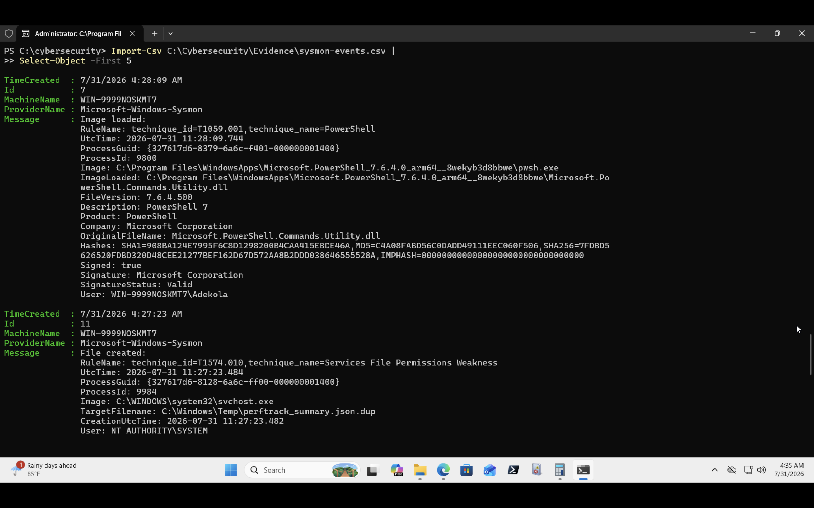
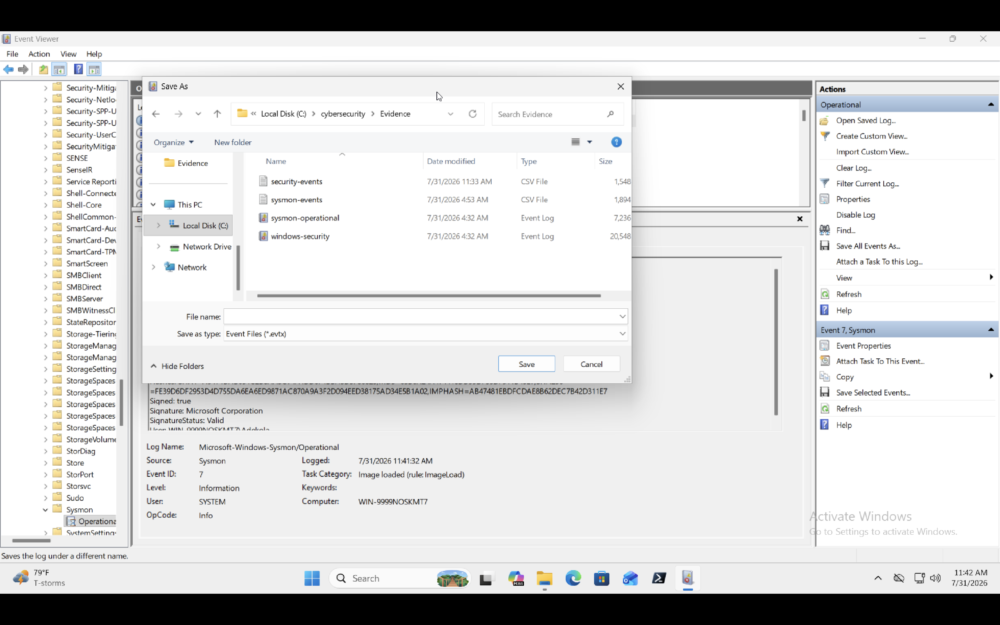
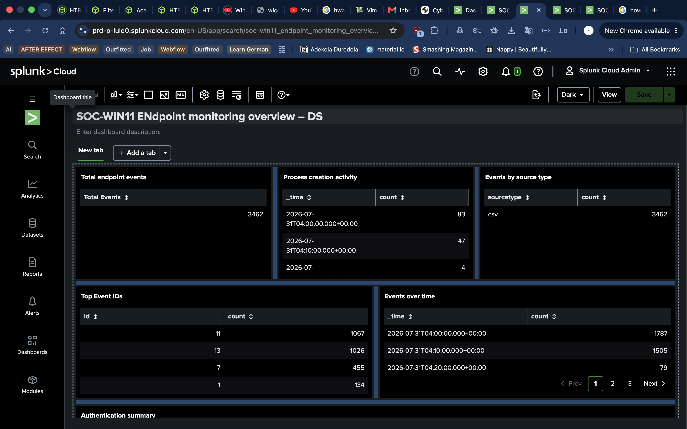

# Home SOC Lab, Part 1: SIEM Implementation

## Executive Summary

Security logs generated on individual endpoints provide valuable information, but investigating incidents becomes increasingly difficult when data is scattered across multiple systems. Security Information and Event Management (SIEM) platforms solve this problem by centralizing logs, making them searchable, and enabling analysts to investigate events efficiently.

In this lab, I implemented a Splunk-based SIEM workflow by collecting Windows Security and Sysmon telemetry from a Windows 11 ARM virtual machine, exporting the logs, and ingesting them into a hosted Splunk environment.

Within Splunk, I validated timestamps, assigned metadata, searched indexed events using SPL (Search Processing Language), and created dashboards to visualize endpoint activity.

Because Splunk Enterprise and the Windows Universal Forwarder do not officially support the ARM architecture used by my MacBook M1 and Windows 11 ARM virtual machine, I intentionally used exported telemetry instead of unsupported real-time forwarding. This approach allowed me to practice the core responsibilities of a SOC analyst while maintaining a realistic and upgradeable architecture.

---

## Objectives

The objective of this lab was to understand how security telemetry is collected, centralized, and analyzed within a SIEM platform.

- Understand the role of a SIEM in security operations.
- Collect Windows Security and Sysmon telemetry.
- Export endpoint logs for ingestion.
- Import telemetry into Splunk.
- Validate timestamps and metadata.
- Perform log analysis using SPL.
- Build dashboards to visualize endpoint activity.
- Document the implementation and investigation process.

---

## Why Centralized Logging matters

Endpoints continuously generate valuable security data, including authentication events, process execution, and system activity. When these logs remain isolated on individual machines, investigations become slow and difficult.

Centralized logging allows security teams to:

- Search all logs from one location.
- Correlate activity across multiple systems.
- Detect suspicious behaviour more quickly.
- Build alerts and dashboards.
- Retain evidence for investigations and compliance.

This forms the foundation of modern Security Operations Centers (SOCs).

---

## Lab Environment

### Host Machine: Apple MacBook M1
#### Virtualization: UTM
### Guest Operating System: Windows 11 ARM
### SIEM Platform: Cloud hosted Splunk
### Endpoint Monitoring: Sysmon
### Additional Logs: Windows Security Logs

---

## Tools and Data Sources

| Tool | Purpose |
|---|---|
| Sysmon | Endpoint telemetry collection |
| WIndows Event Viewer | Security log review |
| PowerShell | Endpoint activity generation |
| Hosted Splunk | Log ingestion and analysis |
| SPL | Querying indexed events |

## Data Sources

- Windows Security Log
- Sysmon Operational Log
- PowerShell activity
- Process creation events

---

## Skills Demonstrated

- SIEM Fundamentals
- Splunk Administration
- Windows Event Analysis
- Sysmon Telemetry
- Log Ingestion
- SPL Querying
- Dashboard Development
- Troubleshooting
- Security Documentation

---

## Architechture

---

## Hardware Constraints

Splunk Enterprise and the Windows Universal Forwarder do not officially support the ARM architecture used by my MacBook M1 and Windows 11 ARM virtual machine.

Rather than deploying an unsupported configuration, I exported controlled Windows Security and Sysmon telemetry and onboarded it into a hosted Splunk environment.

Although this approach does not provide live forwarding, it allowed me to practice:

- Data ingestion
- Metadata assignment
- Timestamp validation
- SPL searches
- Dashboard creation
- Investigation workflow

The architecture can later be upgraded to real-time forwarding on supported hardware.

---

## Implementation

### 01 Windows Telemetry Generation

To generate meaningful data, I performed several normal endpoint activities including:

- Interactive logons
- Launching PowerShell
- Opening File Explorer
- Executing basic PowerShell commands

These actions generated Windows Security and Sysmon events for analysis.

---

### 02 Log Export

Windows Security and Sysmon logs were exported from Event Viewer before being prepared for ingestion into Splunk.

This approach preserved the event metadata while avoiding unsupported ARM forwarding.

---

### 03 Splunk Data Onboarding

The exported logs were uploaded into the hosted Splunk environment.

During onboarding I verified:

- Source type
- Host
- Event count
- Timestamp parsing

---

### 04 TImestamp and Source-type validation

After indexing, I verified:

- Events appeared within the expected time range.
- Source type was correctly assigned.
- Event timestamps matched the original Windows logs.

This validation is essential because inaccurate timestamps can lead to incorrect investigation timelines.

---

## Investigation Workflow

The investigation followed a simple SOC workflow:

- Generate endpoint activity.
- Collect Windows and Sysmon logs.
- Export telemetry.
- Import logs into Splunk.
- Validate indexed events.
- Query events using SPL.
- Build dashboard visualizations.
- Review findings.

---

## SPL Searches

Examples of searches performed during this lab:

#### 01 View all indexed events

_index=endpoint_

#### 02 Search PowerShell execution

_index=main message=powershell_

#### Search Sysmon Process Creation events

_index=main EventCode=1_

#### Search successful & failedlogons

_index=main EventCode=4624 AND 4625_

#### Count events by source

_index=main_
_| stats count by sourcetype_

---

## Dashboard

A simple dashboard was created to visualize:

- Event volume over time.
- Successful logons.
- Failed logons.
- Process creation events.
- Events grouped by source type.

The dashboard demonstrates how analysts can move from raw logs to operational visibility.

📸 Screenshot

splunk-dashboard.png

---

## Validation

To confirm that the implementation was successful, I verified:

- Logs were exported correctly.
- Splunk accepted the uploaded data.
- Events were indexed successfully.
- Searches returned expected results.
- Dashboard panels displayed accurate information.
- Event timestamps aligned with the original telemetry.

---

## Evidence

| Evidence | What it proves |
|---|---|
| Sysmon export | Endpoint telemetry was collected |
| Windows Security export | Native security events were preserved |
| Splunk upload preview | Data parsing was reviewed |
| Indexed events | Telemetry became searchable |
| SPL queries | Analyst questions were answered |
| Dashboard | Monitoring information was summarized |
| Timeline | Activity was reconstructed chronologically |

----

## Challenges and Troubleshooting

### Problem

Some imported events initially appeared outside the expected search time range.

### Cause

The event timestamps were interpreted differently during ingestion because of timestamp parsing and selected search window settings.

### Troubleshooting Steps

- Verified the original event timestamps.
- Adjusted the Splunk search time range.
- Confirmed the source type configuration.
- Re-ran searches using broader time windows.

### Resolution

After correcting the search window and validating timestamp parsing, the expected events became visible and could be queried successfully.

----

## What I Learned

Even when logs are successfully ingested, incorrect timestamps or metadata can make valuable evidence appear to be missing. Validating data quality is just as important as collecting the data itself.

----

## Security and Privacy Considerations

To protect sensitive information:

- Only telemetry generated within my own lab environment was used.
- No production systems or third-party data were collected.
- Personally identifiable information was excluded where appropriate.
- This lab was conducted entirely in an isolated virtual machine.

----

## Current Limitations

This implementation has several intentional limitations:

- No live Windows Universal Forwarder deployment.
- Manual log export rather than continuous forwarding.
- Single Windows endpoint.
- Hosted Splunk rather than self-managed infrastructure.

These limitations were introduced by the ARM architecture while still allowing meaningful SIEM practice.

---

## Future Architecture

Future improvements include:

- Deploying a supported Windows x64 environment.
- Configuring the Splunk Universal Forwarder.
- Enabling real-time endpoint telemetry.
- Adding multiple endpoints.
- Integrating Linux log sources.
- Creating custom detection rules and alerts.
- Mapping detections to the MITRE ATT&CK framework.

----

## Lessons Learned

This lab helped me understand that implementing a SIEM is much more than installing software. Success depends on collecting high-quality telemetry, validating the data, and asking meaningful questions through searches and visualizations.

Working within hardware limitations also reinforced an important lesson: effective security engineering often requires adapting to constraints while documenting them transparently. By using exported telemetry instead of unsupported live forwarding, I was still able to practice the core SIEM workflows used in security operations.

---

## References

- Microsoft Sysinternals, Sysmon Documentation
- Microsoft Windows Event Log Documentation
- Splunk Search Processing Language (SPL) Documentation
- MITRE ATT&CK Framework
- Windows Event ID Encyclopedia
