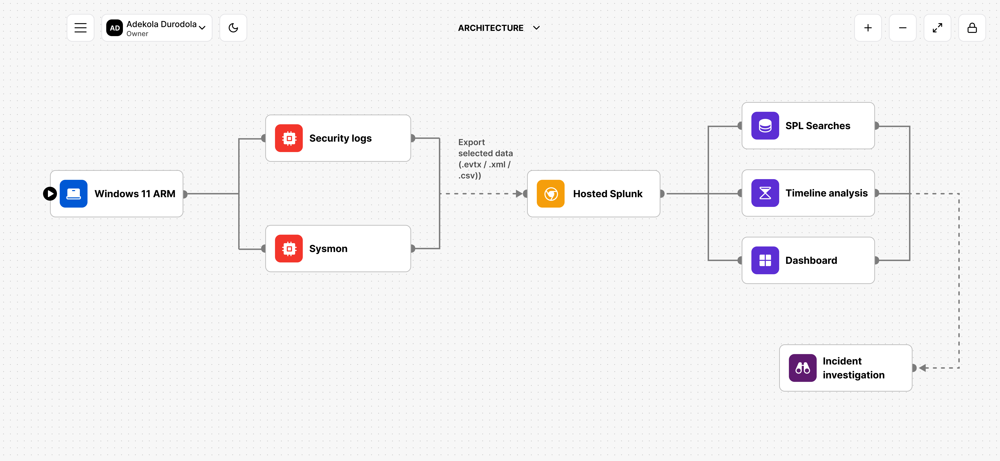
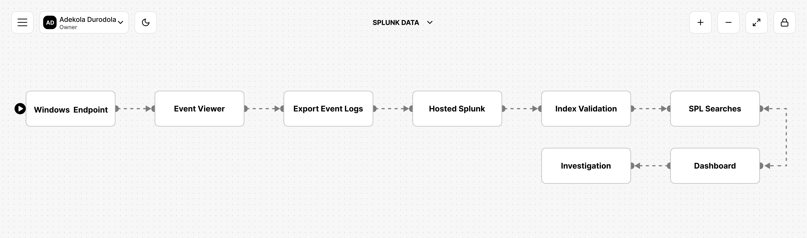
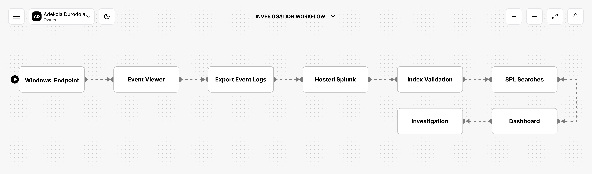
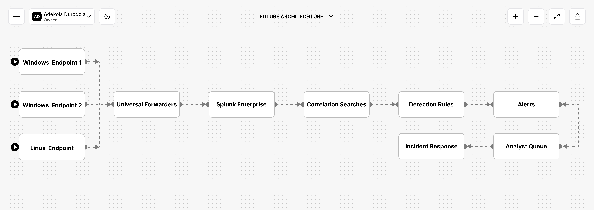

# Architecture Design

> **Project:** SIEM Detection Lab: Windows Event Investigation with Splunk

---

## Purpose

The purpose of this architecture is to simulate how endpoint telemetry is collected, centralized, and investigated within a Security Operations Center (SOC).

Rather than attempting to deploy an unsupported real-time forwarding solution on ARM hardware, this lab focuses on building an investigation workflow that mirrors the responsibilities of a SOC analyst while remaining technically accurate and reproducible.

The architecture prioritizes:

- Reliable telemetry collection
- Structured log ingestion
- Investigation quality
- Transparency regarding implementation constraints
- Future scalability

---

# Architecture Overview

---

# Architecture Components

## 1. Host Machine

**Platform**

MacBook Air M1

### Purpose

Acts as the primary workstation hosting the virtual lab environment.

### Responsibilities

* Run virtualization software
* Store exported telemetry
* Access Splunk
* Document investigations

---

## 2. Virtualization Layer

**Platform**

UTM

### Purpose

Provide an isolated Windows environment for generating endpoint telemetry.

### Why UTM?

UTM supports Apple Silicon devices and allows Windows ARM virtual machines to run efficiently without modifying the host operating system.

---

## 3. Windows Endpoint

**Operating System**

Windows 11 ARM

### Purpose

Serve as the monitored endpoint.

### Activities Generated

* User logon
* PowerShell execution
* Process creation
* File Explorer activity
* DNS lookups
* Network communication

These actions generated telemetry for investigation.

---

## 4. Windows Security Logs

### Purpose

Record native Windows security events.

### Events Reviewed

* Event ID 4624
* Event ID 4625

### Investigation Value

These logs provide authentication evidence including:

* Successful logons
* Failed logons
* User accounts
* Logon types
* Authentication timestamps

---

## 5. Sysmon

### Purpose

Extend Windows logging by providing richer endpoint telemetry.

### Events Used

* Event ID 1 (Process Creation)

Additional Sysmon telemetry may include:

* DNS events
* Network connections
* Process termination
* Image loading

### Investigation Value

Sysmon provides context that is not always available in native Windows Security logs, including:

* Parent-child process relationships
* Command-line arguments
* Process GUIDs
* Process hashes
* User context

---

# Why Sysmon?

Windows Security logs answer questions such as:

> Who logged in?

Sysmon helps answer:

* What process started?
* Which process launched it?
* Which command was executed?
* What happened immediately before and after?

That additional visibility is essential during endpoint investigations.

---

# Telemetry Collection

Telemetry was intentionally generated through controlled user activity.

Examples included:

* Interactive logons
* Opening PowerShell
* Running basic PowerShell commands
* Launching Windows applications

No malicious software was executed.

All telemetry originated from authorized laboratory activity.

---

# Log Export Strategy

Because the Windows Universal Forwarder is not officially supported in this ARM-based lab environment, telemetry was exported manually before ingestion into Splunk.

### Advantages

* Supported workflow
* Preserves event metadata
* Enables repeatable investigations
* Maintains accurate timestamps

### Limitation

No continuous real-time forwarding.

---

# Splunk Data Pipeline

The exported logs followed the following workflow:

Each stage was validated before moving to the next.

---

# Investigation Workflow

Every investigation followed the same repeatable methodology.

This approach helps reduce assumptions and supports evidence-based decision making.

---

# Design Decisions

## Hosted Splunk

### Decision

Use Splunk Cloud rather than a locally hosted Splunk Enterprise instance.

### Reason

Avoid unsupported ARM deployment while still practicing SIEM workflows.

---

## Manual Log Export

### Decision

Export Windows Security and Sysmon logs before ingestion.

### Reason

Maintains compatibility with ARM hardware and preserves investigation quality.

---

## Single Endpoint

### Decision

Investigate one Windows endpoint.

### Reason

Simplifies validation and allows focus on investigation methodology before expanding to multiple systems.

---

## Structured Incident Reports

### Decision

Separate each investigation into its own report.

### Reason

This mirrors real SOC documentation practices and keeps investigations independent, reusable, and easier to review.

---

# Security Considerations

The lab was designed to remain safe throughout testing.

Measures included:

* Isolated virtual machine
* Controlled telemetry generation
* No malware execution
* No external production systems
* No sensitive organizational data

---

# Current Limitations

The current implementation intentionally has several limitations.

- Single endpoint
- Manual telemetry export
- Hosted SIEM
- No endpoint forwarding
- No alert automation
- Limited event diversity

These limitations are documented to accurately represent the project.

---

# Future Architecture

Future versions of this lab will introduce additional components.

Future enhancements include:

- Real-time forwarding
- Multi-endpoint monitoring
- Linux telemetry
- Detection engineering
- Threat hunting
- Alert automation
- MITRE ATT&CK coverage reporting

---

## Architecture Validation

The architecture successfully demonstrated:

- Endpoint telemetry generation
- Windows Security logging
- Sysmon telemetry collection
- SIEM ingestion
- Metadata validation
- Timeline reconstruction
- Investigation workflow
- Dashboard visualization

---

## Key Takeaways

This architecture demonstrates that meaningful SIEM investigations can be performed even when hardware limitations prevent a traditional deployment.

By documenting those constraints transparently and adapting the design accordingly, the lab remains technically accurate while still showcasing the core workflows used by SOC analysts.

The architecture is intentionally modular, allowing future projects to build on this foundation by introducing live log forwarding, additional endpoints, and more advanced detection capabilities.

