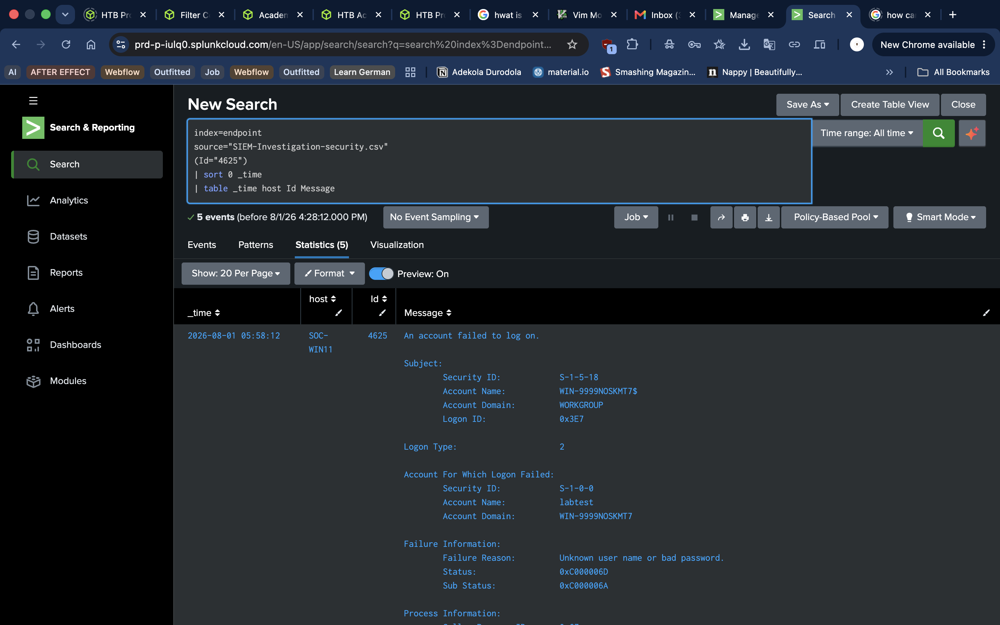
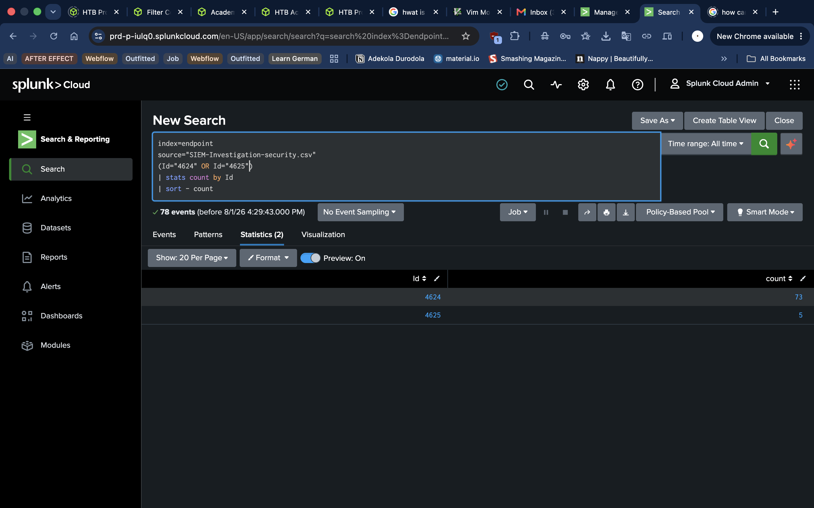

# Home SOC Lab, Part 2: SIEM Detection Lab: Windows Event Investigation with Splunk

> Security investigation & Detection engineering

---

## Executive Summary

Collecting logs is only the first step in a Security Operations Center (SOC). The real value comes from transforming those logs into evidence that supports security investigations.

In this lab, I investigated Windows Security and Sysmon telemetry using Splunk to simulate the daily workflow of a SOC analyst. Rather than simply demonstrating log ingestion, the project focused on developing investigation methodology, validating hypotheses, reconstructing event timelines, and documenting findings supported by evidence.

Three realistic investigation scenarios were performed using controlled telemetry generated within my Windows 11 ARM laboratory environment.

- Repeated failed logon attempts
- PowerShell execution
- Process creation, DNS activity, and network events

Each investigation followed a structured workflow including hypothesis development, evidence collection, timeline reconstruction, analysis, MITRE ATT&CK mapping, investigation outcome, and recommended analyst actions.

Because every event originated from authorized laboratory testing, each investigation concluded with a Benign Positive verdict. This reinforces an important security principle: suspicious indicators should never be treated as malicious without sufficient supporting evidence.

---

## Business Context

Organizations generate thousands or millions of security events every day.

Without structured investigation processes, analysts can quickly become overwhelmed by alerts and risk missing genuine threats.

The purpose of this project was to demonstrate how SIEM platforms help analysts:

- Investigate endpoint activity
- Validate alerts
- Build timelines
- Reduce false positives
- Document findings
- Support incident response

Rather than focusing solely on tool usage, this project emphasizes the analytical thinking required during security investigations.

---

## Objectives

The objective of this lab was to practice the investigation workflow used by SOC analysts when reviewing Windows endpoint telemetry inside a SIEM.

- Investigate Windows Security events.
- Investigate Sysmon telemetry.
- Develop investigation hypotheses.
- Build chronological event timelines.
- Validate evidence using SPL.
- Document findings using an analyst report format.
- Produce investigation outcomes supported by evidence.

---

## Success Criteria

The project was considered successful if I could:

- Generate endpoint telemetry
- Search indexed logs
- Validate event timestamps
- Investigate three realistic scenarios
- Produce evidence-supported conclusions
- Document findings using SOC-style reports

---

## Why Investigation Matters

Security alerts rarely provide complete answers.

An alert simply indicates that something deserves attention. It is the analyst's responsibility to gather evidence, understand context, and determine whether the activity is malicious, benign, or requires further monitoring.

This lab focused on developing that analytical mindset rather than simply executing searches.

---

## Lab Environment

### Host Machine: Apple MacBook M1
#### Virtualization: UTM
### Guest Operating System: Windows 11 ARM
### SIEM Platform: Cloud hosted Splunk
### Endpoint Monitoring: Sysmon
### Log Sources: Windows Security Logs, Sysmon

---

## Tools and Data Sources

| Tool | Purpose |
|---|---|
| Sysmon | Endpoint telemetry collection |
| WIndows Event Viewer | Security log review |
| PowerShell | Endpoint activity generation |
| Hosted Splunk | Log ingestion and analysis |
| SPL | Querying indexed events |

## Data Sources

The investigations used the following telemetry sources:

- Windows Security Log
- Sysmon Operational Log
- Process Creation Events
- Authentication Events
- DNS Activity
- Network Events

---

## Skills Demonstrated

- Security Investigation
- Windows Event Analysis
- Sysmon Analysis
- Splunk SIEM
- SPL Querying
- Timeline Analysis
- Evidence Collection
- Detection Engineering Fundamentals
- Security Documentation

---

## Architechture

---

## Investigation Methodology

Each investigation followed the same structured workflow.

1. Review the alert or suspicious activity.
2. Form an initial hypothesis.
3. Define the investigation scope.
4. Collect supporting evidence.
5. Build an event timeline.
6. Analyze available telemetry.
7. Map relevant MITRE ATT&CK techniques.
8. Determine investigation outcome.
9. Recommend next steps.

This repeatable methodology ensures investigations remain evidence-based rather than assumption-driven.

---

## Investigation Cases

### SOC-2026-CASE-001 — Repeated Failed Logons

#### Scenario

Multiple failed authentication events were identified within a short period.

#### Initial Hypothesis

Repeated authentication failures may indicate:

- Incorrect credentials
- User error
- Password spraying
- Brute-force activity

Further investigation was required before drawing conclusions.

#### Evidence Reviewed

- Event ID 4625
- Event ID 4624
- Account Name
- Source Host
- Timestamp
- Logon Type

  

#### Timeline

Five failed authentication attempts occurred before one successful logon.

  

#### Analysis

The failed authentication events originated from the controlled laboratory account.

The successful authentication immediately following the failed attempts matched the documented testing procedure.

No account lockout occurred.

No additional hosts participated.

The available evidence supports normal laboratory testing rather than malicious authentication activity.

  

#### MITRE ATT&CK Context

Potential Technique:

- T1110 — Brute Force

_Not confirmed._

#### Investigation Outcome

| Item | Result |
|---|---|
| Classification | Benign Positive |
| Severity | Low |
| Confidence | High |
| Status | Closed |

#### Recommended Action

No response required.

Continue monitoring authentication behaviour.

*Figure 1. Windows Event ID 4625 events associated with the controlled laboratory account during the documented investigation window.*

*Figure 2. Summary of failed authentication attempts observed for the investigated account.*

---

### SOC-2026-CASE-002 — PowerShell Execution

#### Scenario

PowerShell execution was identified within Sysmon telemetry.

#### Initial Hypothesis

PowerShell execution could represent:

- Administrative activity
- Automation
- Script execution
- Post-exploitation

Further analysis was required.

#### Evidence Reviewed

- Sysmon Event ID 1
- Process Name
- Parent Process
- User Account
- Command Line
- Timestamp

  

#### Timeline

PowerShell launched shortly after interactive user logon.
  

#### Analysis

Sysmon recorded PowerShell execution with complete process metadata.

The parent process was explorer.exe, consistent with normal interactive user behaviour.

The command executed matched the documented lab activities.

Although PowerShell is frequently abused by attackers, the available evidence supports authorized execution.

  

#### MITRE ATT&CK Context

Potential Technique:

- T1059.001 — PowerShell

_Observed but not malicious._

#### Investigation Outcome

| Item | Result |
|---|---|
| Classification | Benign Positive |
| Severity | Low |
| Confidence | High |
| Status | Closed |

#### Recommended Action

No action required.

Continue monitoring PowerShell activity for unusual execution patterns.

---

### SOC-2026-CASE-003 — Process, DNS and Network Activity

#### Scenario

Process creation events and associated DNS and network activity were reviewed.

#### Initial Hypothesis

The observed activity could indicate:

- Normal application behaviour
- Software updates
- Network communications
- Potential command-and-control traffic

Evidence was reviewed before classification.

#### Evidence Reviewed

- Sysmon Event ID 1
- DNS Queries
- Network Events
- Process Metadata
- Timestamp

  

#### Timeline

Process execution preceded DNS resolution and normal network communication.
  

#### Analysis

The observed activity followed an expected sequence:

Process Creation –>> DNS Resolution –>> Network Connection

The timing and event sequence matched expected application behaviour.

No indicators suggested persistence, lateral movement, or malicious outbound communication.
  

#### Investigation Outcome

| Item | Result |
|---|---|
| Classification | Benign Positive |
| Severity | Low |
| Confidence | High |
| Status | Closed |

#### Recommended Action

Continue routine monitoring.

No escalation required.

---

## Detection Candidates

The following detection opportunities were identified during this lab.

| Detection | SPL Focus |
|---|---|
| Repeated Failed Logons | Event ID 4625 |
| Successful Logons | Event ID 4624 |
| PowerShell Execution | Sysmon Event ID 1 |
| Process Creation | Sysmon Event ID 1 |
| DNS Activity | Sysmon DNS Events |
| Network Connections | Sysmon Network Events |

These detections can later be expanded into Splunk alerts and Sigma rules.

---

## Validation

These detections can later be expanded into Splunk alerts and Sigma rules.

- Windows telemetry was searchable.
- Sysmon events were available.
- Event timelines could be reconstructed.
- SPL searches answered investigative questions.
- Evidence supported investigation conclusions.
- Findings were documented using a repeatable methodology.

----

## Challenges and Troubleshooting

### Problem

Some expected events did not initially appear during searches.

### Cause

The selected search window did not align with the imported event timestamps.

### Troubleshooting Steps

- Expanded the search time range.
- Validated timestamps.
- Verified indexed events.
- Confirmed source type configuration.

### Resolution

The expected telemetry became visible after adjusting the search parameters.

## What I Learned

Missing search results do not always indicate missing data. Timestamp validation should always be part of the investigation process.

----

## Security and Privacy Considerations

- All telemetry originated from my personal lab environment.
- No production systems were involved.
- No third-party data was collected.
- Testing was conducted within an isolated Windows virtual machine.

----

## Current Limitations

- Single endpoint.
- Manual telemetry ingestion.
- No live forwarding.
- Controlled laboratory environment.
- Limited event diversity.

---

## Lessons Learned

This lab reinforced that successful investigations depend on evidence rather than assumptions.

One of the biggest lessons was understanding that suspicious indicators alone are not proof of malicious activity. Context, supporting telemetry, timelines, and analyst judgement are equally important.

Following a structured investigation methodology also made it easier to explain findings clearly and consistently.

----

## Future Improvements

The next iteration of this project will include:

- Multiple Windows endpoints.
- Real-time log forwarding.
- Detection engineering using Sigma rules.
- Custom Splunk alerts.
- MITRE ATT&CK coverage mapping.
- Simulated attack scenarios.
- Threat hunting exercises.

---

## References

- Microsoft Sysmon Documentation
- Microsoft Windows Event Documentation
- Splunk Search Processing Language (SPL)
- Splunk Documentation
- MITRE ATT&CK Framework
- Windows Security Auditing Documentation

