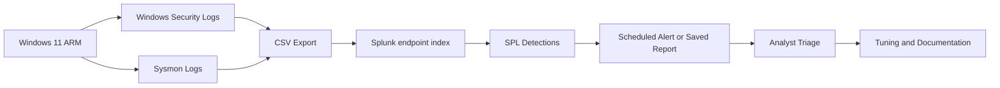
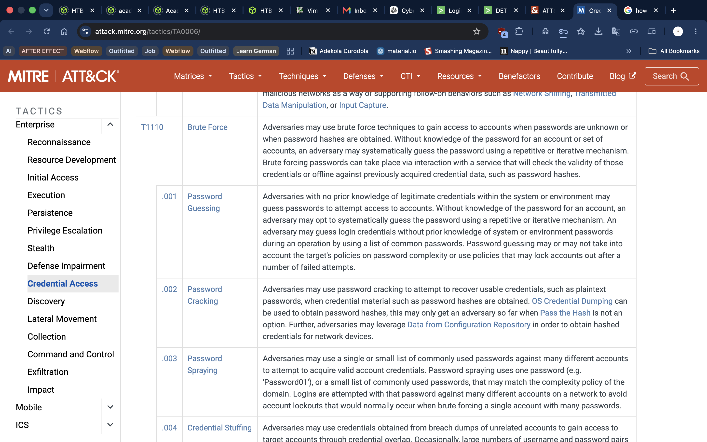

# Threat Detection Lab: Splunk Detections Mapped to MITRE ATT&CK

## Executive Summary

This project converts three Windows investigation findings into reusable Splunk detection logic:

| ID | Detection | Telemetry | ATT&CK | Initial priority |
|---|---|---|---|---|
| DET-001 | Multiple failed logons for one account | Windows Security, Event ID 4625 | T1110.001 Password Guessing | Low |
| DET-002 | Encoded PowerShell execution | Sysmon, Event ID 1 | T1059.001 PowerShell | Medium |
| DET-003 | PowerShell DNS Query activity | Sysmon, Event IDs 22 | T1059.001 PowerShell | Medium |

The project demonstrates how I move from an investigation finding to a detection hypothesis, SPL logic, controlled validation, tuning, alert design, analyst response, and documented limitations.

---

## Objective

Build and document a small threat detection lab that:

1. Detects defined suspicious behaviours in Windows telemetry.
2. Proves detection behaviour with controlled tests.
3. Records false positives, limitations, and tuning decisions.
4. Map detections to the MITRE ATT&CK framework
5. Produces actionable investigation leads rather than claiming malicious intent.

---

## Recruiter Scan

**Problem:** Manual searches do not scale and broad searches create excessive noise.

**Approach:** I converted known behaviours into three scoped detections, tested expected and normal activity, documented false positives, and added analyst context.

**Key decisions:**

| Decision | Reason | Security value |
|---|---|---|
| Use five failures in ten minutes for DET-001 | A practical lab threshold, not a universal standard | Demonstrates threshold-based detection without overstating certainty |
| Keep successful logon checking as enrichment | A success after failures changes risk, but does not belong in the first version | Keeps the primary rule simple and supports deeper triage |
| Detect `-EncodedCommand` and `-enc` for DET-002 | These are more precise than all PowerShell activity | Reduces noise while preserving suspicious execution visibility |
| Exclude broad `-e` matching initially | `-e` may appear inside unrelated arguments | Avoids avoidable false positives |
| Use Event ID 3 only when available | Network detection requires network telemetry | Prevents unsupported claims |
| Use Event ID 22 as a named DNS fallback | DNS evidence is not the same as an outbound connection | Maintains accurate detection language |
| Map DET-003 primarily to T1059.001 | Network activity alone does not prove command and control | Keeps ATT&CK coverage defensible |

---

## Data sources

| Source | Purpose |
|---|---|
| Windows Security Log | Authentication events |
| Sysmon Event ID 1 | Process creation |
| Sysmon Event ID 3 | Network connections |
| Sysmon Event ID 22 | DNS Query |
| Powershell | Script execution |
| Plunk Index | Search and correlation |

---

## Lab Environment

#### Host Machine: Apple MacBook M1
#### Virtualization: UTM
#### Endpoint used for controlled activity: Windows 11 ARM
#### Search, detection logic, reports, and alerts: Cloud hosted Splunk
#### Process, DNS, and network telemetry: Sysmon
#### Authentication telemetry: Windows Security Logs
#### Safe validation activity: Powershell
#### Detection coverage visualization: ITRE ATT&CK Navigator
#### Versioned portfolio documentation: GitHub

---

## Skills Demonstrated

- Detection hypothesis development
- Windows Security and Sysmon analysis
- SPL field extraction, aggregation, and correlation
- Positive, negative, boundary, and repeat validation
- False-positive analysis and tuning
- MITRE ATT&CK mapping
- Alert design and analyst triage
- Evidence-based technical documentation

---

## Architecture

The environment consists of a Windows endpoint generating Sysmon and Windows Security events that are indexed into Splunk. SPL searches identify predefined behaviours, which are validated and mapped to relevant MITRE ATT&CK techniques before being configured as detections.

---

## Detection Engineering Methodology

This methodology emphasizes reproducibility, transparency, and continuous improvement.

- Investigation finding
- Define detection hypothesis
- Identify required telemetry
- Build SPL query
- Validate against known activity
- Tune to reduce false positives
- Map to MITRE ATT&CK
- Configure alert logic
- Document analyst response guidance
- Maintenance

Full methodology: [Detection-Engineering-Process.md](Detection-Engineering-Process.md)

---

## Detection Coverage

| Detection | Behaviour identified | Status | Detail |
|---|---|---|---|
| DET-001 | Repeated failed Windows logons for one account | T1110.001 Password Guessing | [DET 001](https://github.com/Adeconcept/Home-SOC-Lab/blob/15593410e1d446ffbe82c433a6c57d11173b0956/03_Threat%20Detection%20lab/Detection%20Specifications/DET-001-Repeated-Failed-Logons/Detection.md) |
| DET-002 | PowerShell launched with encoded-command arguments | T1059.001 PowerShell | [DET 002](https://github.com/Adeconcept/Home-SOC-Lab/blob/76b5bd8a49933fcc9f316349f91e9df478d75eba/03_Threat%20Detection%20lab/Screenshots/11_DET_002_encoded.png) |
| DET-003 | PowerShell associated with network or DNS activity | T1059.001 PowerShell | [DET 003](https://github.com/Adeconcept/Home-SOC-Lab/blob/76b5bd8a49933fcc9f316349f91e9df478d75eba/03_Threat%20Detection%20lab/Screenshots/12_DET_003_DNS_Query.png) |

> Note: The current lab intentionally covers a limited subset of ATT&CK techniques. DET-003 includes network activity, but it is primarily mapped to PowerShell execution rather than Command and Control due to the absence of additional adversary context.

---

## Validation Strategy & Result

Each detection is tested against four conditions:

| Test | Purpose |
|---|---|
| Positive | Confirm intended behaviour is detected |
| Negative | Confirm related normal activity does not trigger |
| Boundary | Confirm threshold behaviour |
| Repeat | Confirm consistent results and evaluate duplicate alerting |

| Detection | Tested                 | Result |
| --------- | ---------------------- | ------ |
| DET-001   | Failed logons          | Pass   |
| DET-002   | Encoded PowerShell     | Pass   |
| DET-003   | PowerShell DNS query | Pass   |

---

## Alert Design

The data is uploaded in batches, so scheduled searches are more appropriate than real-time alerts. Where Splunk trial permissions prevent alert deployment, the detection is saved as a report with the intended schedule and trigger documented.

Alert configuration: [Alerts/Alert-Configuration.md](https://github.com/Adeconcept/Home-SOC-Lab/blob/b8e297c59315c94e5d5e912410774213d0c49bd4/03_Threat%20Detection%20lab/Alerts/Configuration.md)

---

## Analyst Response

The detections create investigation leads. They do not independently confirm malicious activity and they do not prevent attacks.

Response playbook: [Alerts/Analyst-Response-Playbook.md]([Alerts/Analyst-Response-Playbook.md](https://github.com/Adeconcept/Home-SOC-Lab/blob/b8e297c59315c94e5d5e912410774213d0c49bd4/03_Threat%20Detection%20lab/Alerts/Response-Playbook.md))

---

## MITRE ATT&CK Coverage

The project intentionally covers only two sub-techniques:

- T1110.001, Password Guessing
- T1059.001, PowerShell

Coverage details: [MITRE-ATTACK/Coverage.md](https://github.com/Adeconcept/Home-SOC-Lab/blob/6a331da616a6c88499f6a1eaa17d9832f92178b9/03_Threat%20Detection%20lab/MITRE%20Attack/Coverage.md)

---

## Main Limitations

- CSV batch uploads are not continuous monitoring.
- Message fields require regex extraction.
- Thresholds are lab values and require production baselining.
- Event ID 3 was unavailable based on Sysmon configuration.
- Encoded PowerShell can be legitimate.
- Network activity does not prove command and control.
- Splunk trial permissions may restrict scheduled alerts.

---

## Project Report

A concise management summary is available in [Project-Report.md](https://github.com/Adeconcept/Home-SOC-Lab/blob/6a331da616a6c88499f6a1eaa17d9832f92178b9/03_Threat%20Detection%20lab/Project-Report).

---

## Lessons Learned

Key lessons from this project include:

- Effective detections require reliable telemetry before SPL development.
- ATT&CK mappings should reflect observed behaviour rather than assumptions.
- Validation is essential to confirm that detections trigger as expected.
- Tuning reduces unnecessary alerts and improves analyst efficiency.
- Clear documentation supports repeatability and knowledge transfer.

---

## References

- MITRE ATT&CK, T1110.001 Password Guessing
- MITRE ATT&CK, T1059.001 PowerShell
- Splunk Search Processing Language documentation
- Splunk alerting documentation
- Microsoft Windows Security auditing documentation
- Microsoft Sysmon documentation

