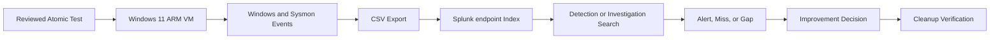

# Atomic Red Team Detection Validation Lab

## Executive Summary

This project validates whether four controlled MITRE ATT&CK behaviours are visible, searchable, detectable, and safely reversible inside an isolated Windows 11 ARM lab.

The work extends the Week 7 detection-engineering project by testing the complete chain:

```text
Atomic test
    -> endpoint telemetry
    -> Splunk ingestion
    -> field extraction
    -> detection or gap
    -> analyst investigation
    -> cleanup
    -> improvement decision
```

No malware, credential access, persistence, security-control disabling, or destructive activity is included.

> Evidence note: fields marked `[Add actual result]` must be completed with the real test number, GUID, timestamps, Splunk output, cleanup result, and screenshots.

## Recruiter Scan

| Validation | Technique | Main question | Portfolio value |
|---|---|---|---|
| VAL-001 | T1082 System Information Discovery | Can system discovery be reconstructed from process telemetry? | Telemetry validation and gap identification |
| VAL-002 | T1016 Network Configuration Discovery | Can several discovery commands be grouped into one sequence? | Behavioural detection design |
| VAL-003 | T1059.003 Windows Command Shell | Can harmless shell and file activity be reconstructed? | Context-based detection judgment |
| VAL-004 | T1027 Obfuscated Files or Information | Does DET-002 detect another obfuscation method? | Detection testing and improvement |

## Key Decisions

| Decision | Reason | Security value |
|---|---|---|
| Run tests only in `SOC-WIN11` | Atomic tests must remain isolated and authorized | Protects the host and keeps testing reproducible |
| Review one exact test before execution | Technique folders may include high-risk tests | Prevents accidental execution outside scope |
| Keep Defender enabled | Prevention is a valid control result | Avoids weakening the lab |
| Test DET-002 unchanged before tuning | Original coverage must be measured honestly | Preserves credible gap evidence |
| Evaluate each validation layer separately | “No alert” can have several causes | Improves root-cause accuracy |
| Verify cleanup | Execution alone is not completion | Demonstrates safe operational discipline |
| Use contextual candidates | Discovery and shell tools are common | Avoids noisy broad alerts |

## Authorization and Scope

Authorized environment:

- Windows 11 ARM virtual machine
- Hostname: `SOC-WIN11`
- UTM isolated personal lab
- Sysmon and Windows telemetry
- Splunk lab environment

Authorized techniques:

- T1082, System Information Discovery
- T1016, System Network Configuration Discovery
- T1059.003, Windows Command Shell
- T1027, harmless obfuscated PowerShell

Full scope: [Atomic-Validation/Safety-and-Scope.md](Atomic-Validation/Safety-and-Scope.md)

## Architecture



## Validation Methodology

| Layer | Question |
|---|---|
| Generation | Did the selected test execute? |
| Collection | Did Windows or Sysmon record it? |
| Ingestion | Did the event reach Splunk? |
| Parsing | Were important fields extractable? |
| Detection | Did an existing rule identify it? |
| Alerting | Was an alert produced when expected? |
| Investigation | Could the activity be reconstructed? |
| Cleanup | Were artifacts removed or confirmed absent? |

## Test Selection Criteria

A test is approved only when it:

- Uses harmless built-in behaviour
- Does not access credentials
- Does not establish persistence
- Does not disable Defender or the firewall
- Does not download unknown payloads
- Does not target another system
- Has reviewed cleanup, or creates no persistent artifact
- Matches the current local test definition

Test matrix: [Atomic-Validation/Test-Matrix.md](Atomic-Validation/Test-Matrix.md)

## Validation Coverage

| ID | Technique | Existing detection expectation | Intended decision |
|---|---|---|---|
| VAL-001 | T1082 | None expected | Draft or defer DET-004 |
| VAL-002 | T1016 | None expected | Draft or defer DET-005 |
| VAL-003 | T1059.003 | None expected | Draft or defer DET-006 |
| VAL-004 | T1027 | Test DET-002 unchanged | Keep, tune, or add DET-007 |

## Validation Reports

- [VAL-001 System Information Discovery](Atomic-Validation/VAL-001-System-Information-Discovery/Validation-Report.md)
- [VAL-002 Network Configuration Discovery](Atomic-Validation/VAL-002-Network-Configuration-Discovery/Validation-Report.md)
- [VAL-003 Windows Command Shell](Atomic-Validation/VAL-003-Windows-Command-Shell/Validation-Report.md)
- [VAL-004 Obfuscated PowerShell](Atomic-Validation/VAL-004-Obfuscated-PowerShell/Validation-Report.md)

## Detection Gaps and Improvements

- [Gap Register](Detection-Gaps/Gap-Register.md)
- [Improvement Backlog](Detection-Gaps/Improvement-Backlog.md)
- [DET-007 Draft](Detection-Improvements/DET-007-Potentially-Obfuscated-PowerShell/Detection.md)

## MITRE ATT&CK Coverage

Week 8 adds validation evidence for T1082, T1016, T1059.003, and T1027. It retains Week 7 coverage for T1110.001 and T1059.001.

One test does not prove complete coverage of an ATT&CK technique.

See [MITRE-ATTACK/Coverage.md](MITRE-ATTACK/Coverage.md).

## Main Limitations

- Atomic tests represent individual behaviours, not complete intrusions.
- CSV uploads are not continuous monitoring.
- Test numbers and definitions can change.
- Sysmon coverage depends on its configuration.
- Discovery commands have many legitimate uses.
- A successful search is not automatically a production-ready alert.
- The small test set does not support meaningful detection-rate percentages.

Full limitations: [Limitations.md](Limitations.md)

## Skills Demonstrated

- Safe adversary emulation
- Risk assessment and test scoping
- Atomic Red Team test review
- Sysmon and Splunk analysis
- Detection validation
- Gap and root-cause analysis
- ATT&CK mapping
- Detection improvement
- Cleanup and rollback verification
- Evidence-based reporting

## Repository Structure

```text
Week-8-GitHub-Ready/
├── README.md
├── Week-8-Project-Report.md
├── Atomic-Validation/
├── Detection-Gaps/
├── Detection-Improvements/
├── MITRE-ATTACK/
├── Limitations.md
└── Lessons-Learned.md
```

