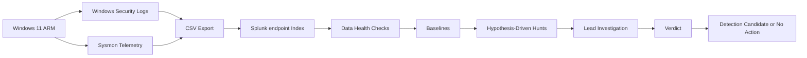

# Architecture

---

## Architecture Decision

The project reuses known investigation, detection-test, Atomic Red Team, and network-analysis datasets.

**Reason:** The behaviour is already understood, allowing hunt logic to be checked against known activity.

**Limitation:** Batch exports do not prove what occurred outside the exported windows.
