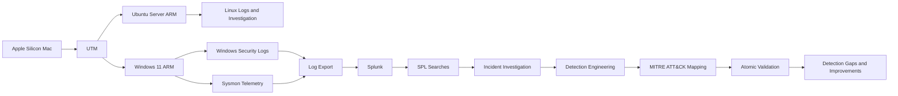

# Home SOC Lab

## Endpoint Monitoring, SIEM Investigation, Detection Engineering, and Safe Adversary Validation

`Windows 11 ARM` `Ubuntu Server ARM` `Sysmon` `Splunk` `PowerShell` `MITRE ATT&CK` `Atomic Red Team`

---

## Executive Summary

This repository documents the development of a personal Security Operations Center lab built to practise the complete defensive-security workflow:

```text
Understand the network
    -> investigate operating systems
    -> collect endpoint telemetry
    -> centralize logs
    -> investigate suspicious behaviour
    -> build detections
    -> validate detections
    -> identify and improve coverage gaps
```

The lab was built on an Apple Silicon Mac using UTM, Windows 11 ARM, Ubuntu Server ARM, Sysmon, Windows Event Logs, PowerShell, and Splunk.

The emphasis is not simply on installing security tools. Each project records the security question, evidence, investigative process, decisions, limitations, and operational value of the result.


---


## Recruiter Snapshot

| Area | What this lab demonstrates |
|---|---|
| Networking | Protocols, ports, addressing, DNS, connections, and traffic context |
| Linux security | Investigation of users, authentication, processes, services, permissions, and logs |
| Windows security | Analysis of Security logs, PowerShell activity, processes, and Windows Event IDs |
| Endpoint monitoring | Deployment and validation of Sysmon telemetry |
| SIEM operations | Log preparation, ingestion, searching, field extraction, and timeline analysis in Splunk |
| Incident investigation | Evidence-based analysis of authentication, PowerShell, DNS, process, and network activity |
| Detection engineering | Detection hypotheses, SPL rules, thresholds, false positives, tuning, and analyst response |
| MITRE ATT&CK | Defensible mapping of observed behaviours to ATT&CK techniques |
| Detection validation | Controlled Atomic Red Team tests, telemetry checks, gap analysis, and cleanup verification |
| Documentation | Recruiter-friendly READMEs, incident reports, SPL files, timelines, screenshots, and decision records |


---


## Objective

The lab develops practical SOC analyst and detection-engineering skills by answering six questions:

1. What activity occurred?
2. Which log source recorded it?
3. Did the event reach the SIEM?
4. Can an analyst reconstruct the activity?
5. Can reusable detection logic identify it?
6. Can the detection be tested and improved safely?


---


## Lab Architecture




---


## Environment

| Component | Role |
|---|---|
| Apple Silicon Mac | Physical host |
| UTM | Virtualization and lab isolation |
| Ubuntu Server ARM | Linux administration and investigation |
| Windows 11 ARM | Endpoint monitoring, investigation, and controlled testing |
| Windows Event Viewer | Windows Security and operational log review |
| Sysmon | Process, network, DNS, and file telemetry |
| PowerShell | Administration, evidence collection, and safe validation activity |
| Splunk | Centralized searching, investigation, detection logic, reports, and alerts |
| MITRE ATT&CK Navigator | Detection and validation coverage mapping |
| Atomic Red Team | Controlled adversary-behaviour validation |
| GitHub | Versioned evidence and portfolio documentation |


---


## Architecture Decisions

| Decision | Reason | Value |
|---|---|---|
| Use UTM with ARM virtual machines | The host uses Apple Silicon | Created a safe and compatible lab without another computer |
| Separate Windows and Linux systems | Each platform provides different telemetry | Broadened endpoint investigation experience |
| Install Sysmon before building detections | Detection quality depends on telemetry | Established process, DNS, network, and file visibility |
| Use Splunk for investigation and detection | A SIEM provides centralized, repeatable analysis | Connected endpoint evidence to SOC workflows |
| Use batch exports where direct ingestion was limited | ARM and hosted-lab constraints affected collection | Preserved the learning objective while documenting the limitation |
| Separate hunting queries from alert logic | Broad searches can be too noisy for alerts | Improved detection signal quality |
| Validate rules with controlled activity | A query that runs is not automatically a working detection | Added positive, negative, boundary, and repeat testing |
| Review one Atomic test at a time | Technique folders can contain higher-risk tests | Maintained safety and authorization |
| Keep Defender enabled | Prevention is a valid result | Avoided weakening controls to force execution |


---


## Project Progression

### 01. Networking Fundamentals

Built the networking foundation required to understand endpoint and SIEM evidence, including IP addressing, ports, protocols, DNS, TCP, UDP, and connection states.

**Security value:** Network context helps distinguish normal communication from activity that requires investigation.

[Open Networking Fundamentals](https://github.com/Adeconcept/Networking-Fundamentals-Lab)

### 02. Linux Investigation

Investigated Linux users, groups, permissions, authentication, processes, services, and logs using native command-line tools.

**Security value:** Demonstrates host investigation without depending entirely on graphical security tools.

[Open Linux Investigation](https://github.com/Adeconcept/Linux-Security-Investigation-Report)

### 03. Windows Investigation

Used Event Viewer and PowerShell to inspect authentication, process activity, Windows Event IDs, and host timelines.

**Security value:** Established the Windows event knowledge needed for later Sysmon and Splunk investigations.

[Open Windows Investigation](https://github.com/Adeconcept/Windows-Security-Investigation)

### 04. Endpoint Monitoring with Sysmon

Installed and verified Sysmon, then reviewed process creation, network connection, DNS query, and file-creation telemetry where available.

**Security value:** Improved endpoint visibility for investigation and detection engineering.

[Open Endpoint Monitoring](https://github.com/Adeconcept/Home-SOC-Lab/blob/5bdc4129b1f396a924d13e95345826c3e918fafc/00_Endpoint%20Monitoring%20Lab/README.md)

### 05. SIEM Implementation with Splunk

Prepared and uploaded endpoint logs, organized sources and sourcetypes, verified ingestion and timestamps, and built initial SPL searches and dashboards.

**Security value:** Converted isolated endpoint events into centralized, searchable security evidence.

[Open SIEM Implementation](https://github.com/Adeconcept/Home-SOC-Lab/blob/5bdc4129b1f396a924d13e95345826c3e918fafc/01_SIEM%20Implementation/README.md)

### 06. Security Event Investigation

Investigated three Windows security scenarios:

| Case | Security question | Evidence reviewed |
|---|---|---|
| Repeated failed logons | Password guessing or legitimate authentication problem? | Event ID 4625, account, host, timing, and surrounding logons |
| Encoded PowerShell | What executed, who launched it, and from which parent? | Sysmon Event ID 1, command line, user, image, and parent |
| Process, DNS, and network activity | Could related endpoint events be reconstructed? | Sysmon process, DNS, and network telemetry |

**Security value:** Demonstrates evidence interpretation, timeline development, verdict writing, and recommended analyst actions.

[Open Security Event Investigation](https://github.com/Adeconcept/Home-SOC-Lab/blob/5bdc4129b1f396a924d13e95345826c3e918fafc/02_SIEM%20Detection%20lab/README.md)

### 07. Detection Engineering and MITRE ATT&CK

Converted investigation findings into reusable Splunk detections:

| Detection | Behaviour | Telemetry | ATT&CK |
|---|---|---|---|
| DET-001 | Multiple failed logons for one account | Windows Security, Event ID 4625 | T1110.001 Password Guessing |
| DET-002 | PowerShell with encoded-command arguments | Sysmon, Event ID 1 | T1059.001 PowerShell |
| DET-003 | PowerShell network activity, or DNS fallback | Sysmon, Event ID 3 or 22 | T1059.001 PowerShell |

Key decisions included documenting thresholds as lab assumptions, keeping broad PowerShell searches as hunting logic, recording false positives, and limiting ATT&CK mappings to what the evidence supports. The detection lab also separates detection, alerting, and investigation rather than treating them as the same activity.

[Open Threat Detection Lab](https://github.com/Adeconcept/Home-SOC-Lab/blob/5bdc4129b1f396a924d13e95345826c3e918fafc/03_Threat%20Detection%20lab/README.md)

### 08. Safe Adversary Emulation and Detection Validation

Used selected low-risk Atomic Red Team behaviours to evaluate the full validation chain:

| Validation | Technique | Objective |
|---|---|---|
| VAL-001 | T1082 System Information Discovery | Validate discovery telemetry |
| VAL-002 | T1016 Network Configuration Discovery | Validate network-discovery telemetry and sequences |
| VAL-003 | T1059.003 Windows Command Shell | Reconstruct harmless command-shell and file activity |
| VAL-004 | T1027 Obfuscated Files or Information | Test whether DET-002 recognizes a different obfuscation method |

The project evaluates generation, collection, ingestion, parsing, detection, alerting, investigation, and cleanup separately. This prevents a missing alert from being incorrectly labelled as a detection failure when the real cause may be telemetry, export, ingestion, or parsing.

[Open Atomic Validation](https://github.com/Adeconcept/Home-SOC-Lab/blob/5bdc4129b1f396a924d13e95345826c3e918fafc/04_Atomic%20Red%20Team%20Detection%20Validation%20Lab/README.md)


---


## Detection and Validation Workflow

```text
Observed behaviour
    -> investigation finding
    -> detection hypothesis
    -> data-source verification
    -> SPL logic
    -> controlled positive test
    -> negative and boundary tests
    -> false-positive analysis
    -> tuning
    -> alert or saved report
    -> Atomic validation
    -> gap analysis
    -> improvement backlog
```


---


## Detection Coverage

| ID | Detection or candidate | Status |
|---|---|---|
| DET-001 | Multiple Failed Windows Logons | Update from project evidence |
| DET-002 | Encoded PowerShell Execution | Update from project evidence |
| DET-003 | PowerShell Network or DNS Activity | Update from available telemetry |
| DET-004 | Unusual System Information Discovery | Candidate |
| DET-005 | Multiple Network Discovery Commands | Candidate |
| DET-006 | Command Shell Script Execution from a Risky Path | Candidate |
| DET-007 | Potentially Obfuscated PowerShell Command Line | Draft learning detection |

Candidate detections are not presented as production-ready. They require reliable telemetry, baselining, negative testing, and tuning.


---


## Investigation Principles

- A detection match is an investigation lead, not proof of compromise.
- A missing alert does not immediately prove rule failure.
- Generation, collection, ingestion, parsing, detection, alerting, investigation, and cleanup are evaluated separately.
- Broad exclusions are not added simply to make an alert quiet.
- Legitimate administrative behaviour is documented as false-positive context.
- Telemetry gaps and failed tests are retained as findings.
- Claims are limited to what screenshots, logs, and searches support.


---


## Evidence Standards

Each project aims to include:

- Executive summary and objective
- Lab environment and architecture
- Commands or SPL used
- Evidence screenshots
- Investigation timeline
- Decisions and rationale
- Result or verdict
- False positives and limitations
- Lessons learned and recommended actions

Sensitive raw logs, credentials, personal email addresses, tokens, and unnecessary system data are not published.


---


## Repository Structure

```text
Home-SOC-Lab/
├── README.md
├── 01-Networking-Fundamentals/
├── 02-Linux-Investigation/
├── 03-Windows-Investigation/
├── 04-Endpoint-Monitoring-Sysmon/
├── 05-SIEM-Implementation-Splunk/
├── 06-Security-Event-Investigation/
└── 07-Threat-Detection-Lab/
    ├── Detections/
    ├── Alerts/
    ├── Test-Evidence/
    ├── MITRE-ATTACK/
    ├── Atomic-Validation/
    ├── Detection-Gaps/
    └── Detection-Improvements/
```

> Update the relative links when your existing GitHub folder names differ from the structure above.


---


## Current Limitations

- The lab uses resource-constrained ARM virtual machines.
- Some logs are exported and uploaded in batches.
- Batch ingestion is not continuous real-time monitoring.
- CSV data requires additional field extraction.
- Splunk trial permissions may restrict scheduled alerts and alert actions.
- Sysmon event availability depends on the active configuration.
- The lab does not process production or third-party data.
- Atomic tests validate selected behaviours, not full attack campaigns.
- Detection candidates require further baselining and tuning.


---


## Future Improvements

- Add continuous Windows and Linux log ingestion
- Normalize fields across data sources
- Introduce a case-management workflow
- Add threat-intelligence enrichment
- Add destination reputation and script-signing context
- Build authentication, process, PowerShell, DNS, and detection-health dashboards
- Version detections and record last-validation dates
- Expand safe ATT&CK validation coverage
- Measure rule quality against a larger test set
- Add endpoint response and SOC automation


---


## Skills Demonstrated

`Networking` · `Linux` · `Windows Security` · `Sysmon` · `Event Viewer` · `PowerShell` · `Splunk` · `SPL` · `Log Analysis` · `Incident Investigation` · `Detection Engineering` · `MITRE ATT&CK` · `Atomic Red Team` · `Technical Documentation`


---


## Author

**Adekola Durodola**

- GitHub: [Adeconcept](https://github.com/Adeconcept)
- Focus: SOC analysis, detection engineering, endpoint security, and security operations
