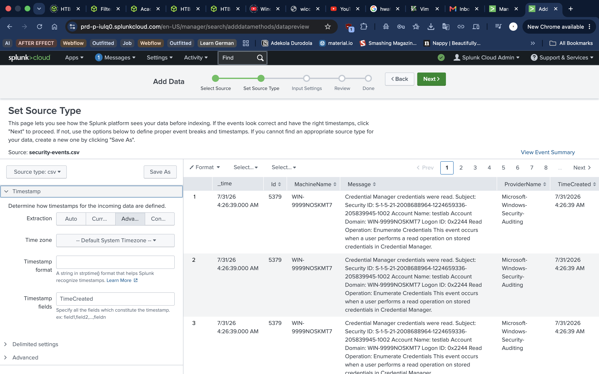

# Architecture

---

## Overview

This lab demonstrates a simplified SIEM architecture built around Windows endpoint telemetry and a hosted Splunk environment.

---

## Data Flow

## Design Decisions

- Hosted Splunk instead of local installation
- Exported logs instead of Universal Forwarder
- Single endpoint for easier validation
- Manual ingestion to accommodate ARM limitations

## Future Improvements

- Multiple endpoints
- Universal Forwarder
- Real-time ingestion
- Detection rules
- Alerting
